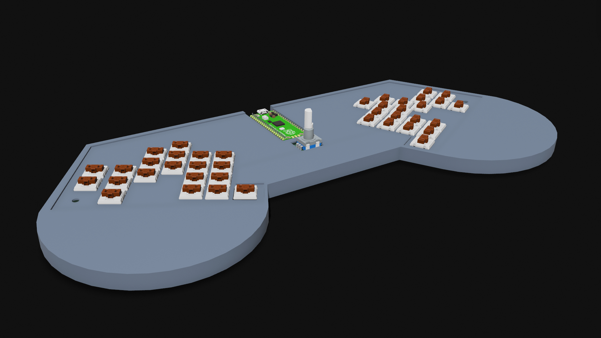
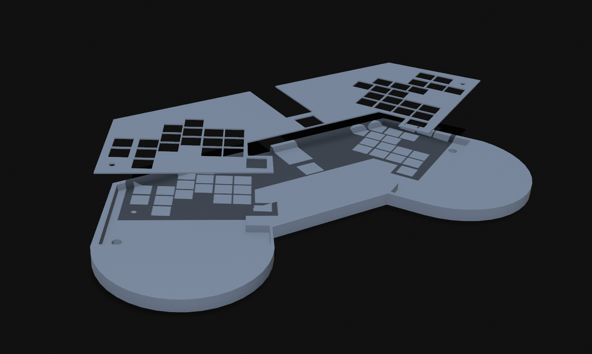
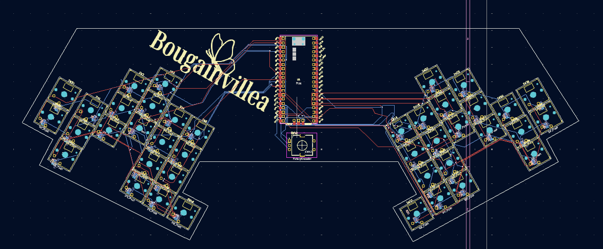

# Bougainvillea Ergo Keyboard by Aryan Pathak

## Description
- A 40 key split keyboard tilted at a comfortable 30 deg angle, with palmrest and knob.
- Built on KMK firmware
- Utilizes choc v1 switches

## Build

## PCB and Schematic

##BOM
- 40x choc v1 jade switches | neomacro.in | 1920 INR = 22.08 USD
- 40x Chocfox CFX Choc Blank Keycaps | neomacro.in | 1400 INR = 16.09 USD
- 1x Orpheus Pico
- 1x Rotary Encoder 
